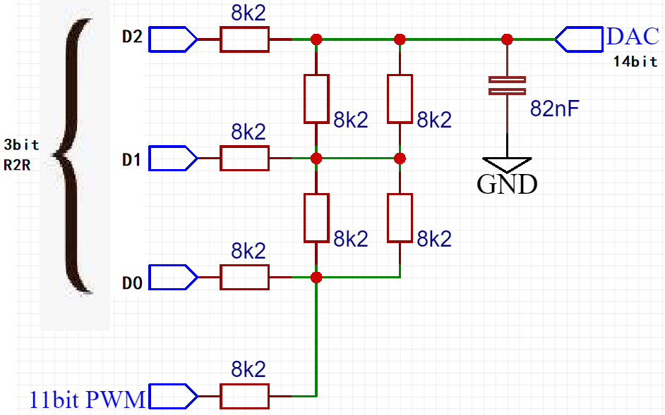
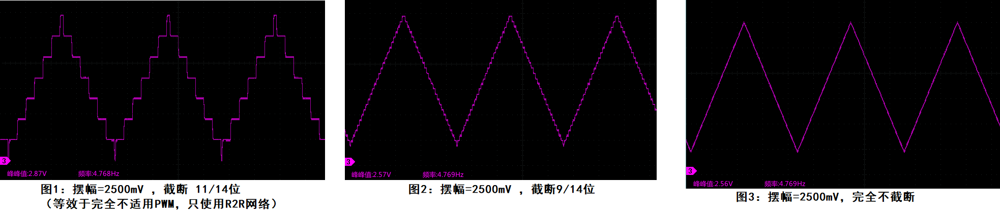
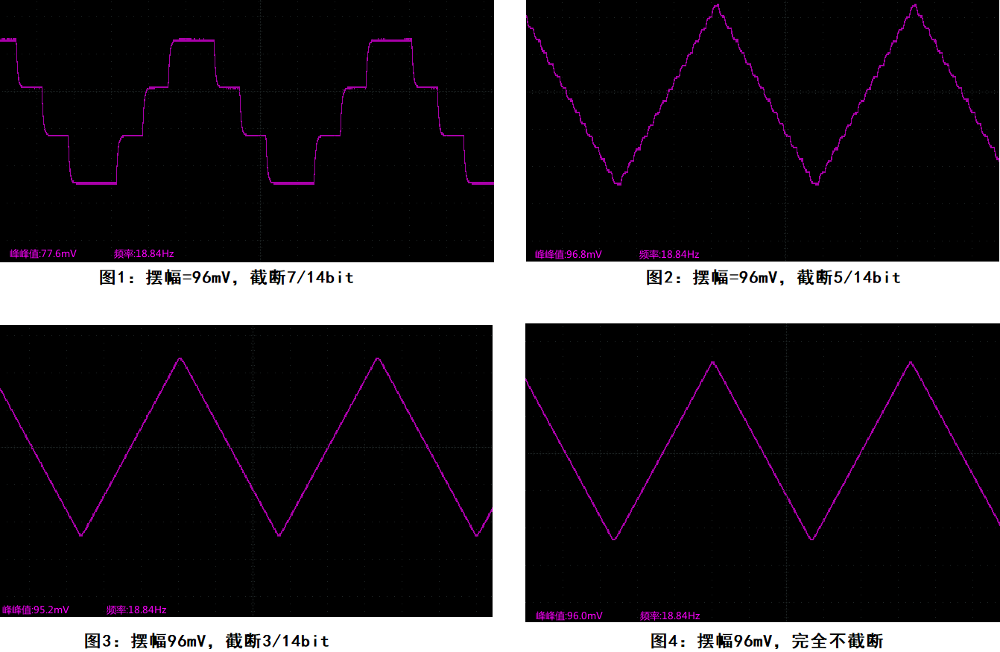
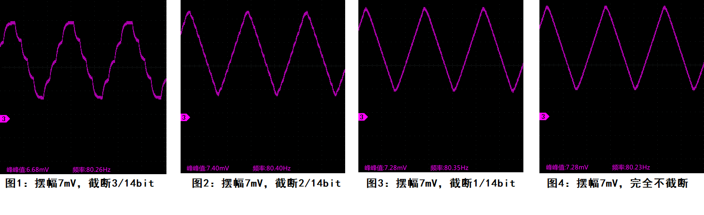
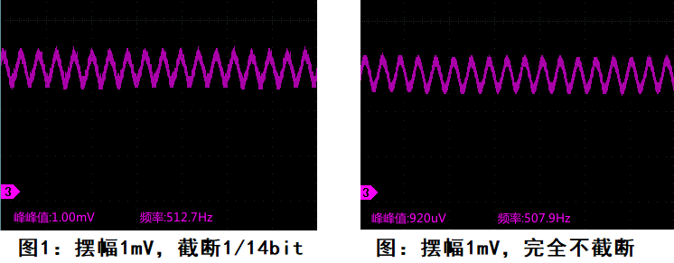

-CAD09D.svg)  

中文 | [English](#en)

FPGA-DAC based on R2R-PWM
===========================

基于 **FPGA** 的 **极简DAC设计**

仅用 FPGA+若干电阻电容，实现 14bit+ 的中低速 DAC，代替 **集成 DAC 芯片** (例如AD5326，DAC8554等)，在FPGA系统中降低成本和电路复杂度。

原理见 [参考网站](https://www.edn.com/design/analog/4458772/Hybrid-PWM-R2R-DAC-improves-on-both "参考网站")。我在此基础上利用 **FPGA的优势** 改进了 PWM 的方式，进一步 **降低了纹波** 。

# 设计

使用 3bit R2R网络 + 11bit PWM 拼成 14bit 6ksps 的 DAC （电路如下）。注意：如果要求 DAC 有带负载能力，还需要在后面加一个运放作为跟随器。

配套的 FPGA 代码见 [RTL](./RTL) 目录，它会生成三角波。仿真代码见 SIM 目录。

|  |
| :-----------------------: |
|  图：R2R网络+PWM 电路图   |

已完成代码和电路，实现了一个14bit的DAC。进行了初步测试，结果不错。但严谨起见还需要对非线性、失码、SNR 进行测量。

# 测试结果

用示波器测量它产生的三角波。为了说明 PWM 产生的低bit是有用的，我进行了不同的位截断来进行比较。

## 大摆幅测试（Vpp=2500mV）

## 中摆幅测试（Vpp=96mV）

## 小摆幅测试（Vpp=7.4mV）

## 微摆幅测试（Vpp=1.0mV）

FPGA-DAC based on R2R-PWM
===========================

A simple **DAC Design** based on **FPGA**

Only FPGA+several resistors and capacitors are used to realize 14bit+ low speed DAC, instead of **integrated DAC chips** (such as AD5326, DAC8554, etc.), reducing cost and circuit complexity in FPGA system.

See the [Reference Website](https://www.edn.com/design/analog/4458772/Hybrid-PWM-R2R-DAC-improves-on-both "Reference Website") for the principle. On this basis, I took advantage of **FPGA** to improve the form of PWM, and further **reduce the ripple**.

# Hardware Design

Use 3bit R2R network + 11bit PWM to form a 14bit 6ksps DAC (circuit as follows). Note: If the DAC is required to have a Rload or Cload, an op amp needs to be added.

See the [RTL](./RTL) folder for the FPGA code, which generates triangle waves. See the [SIM](./SIM) directory for the simulation code.

|                           |
| :------------------------------------------------: |
| **Figure** : R2R + PWM resistor network schematic. |

The code and circuit have been completed, and a 14bit DAC has been implemented. Preliminary tests were conducted and the results were good. However, for the sake of rigor, it is necessary to measure nonlinearity, missing codes, and SNR.

# Test Result

Measure the triangle wave it generated using an oscilloscope. To show that the low bits produced by the PWM are useful, I did different bit truncations for comparison.

## Large swing test (Vpp=2500mV)

## Medium swing test (Vpp=96mV)

## Small swing test (Vpp=7.4mV)

## Tiny swing test (Vpp=1.0mV)

